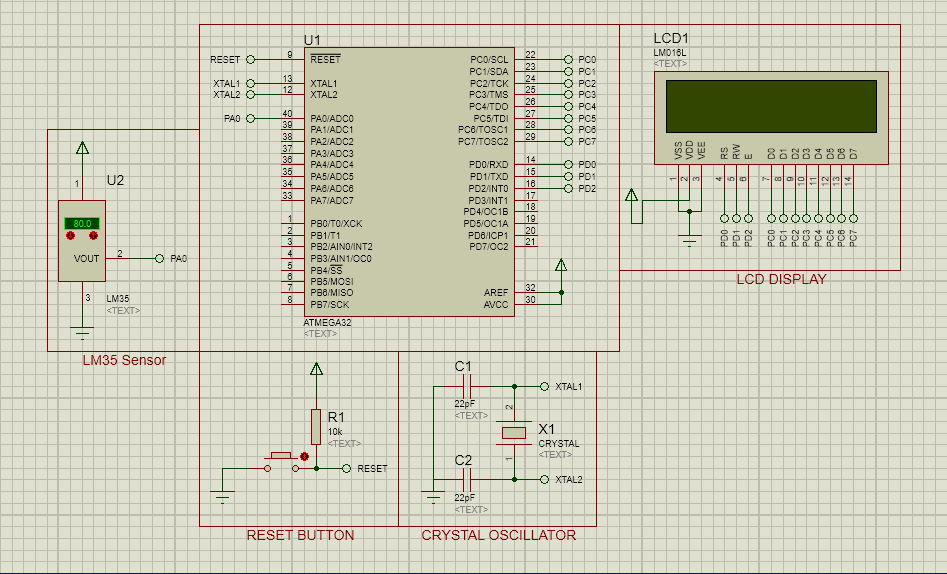

# ATmega32 Temperature Monitoring System with LM35 and 16x2 LCD

## Project Overview
This project demonstrates a temperature monitoring system using an **ATmega32 microcontroller** interfaced with an **LM35 temperature sensor** and a **16x2 LCD display**. The system reads real-time temperature data from the LM35 sensor, converts it to Celsius, and displays it on the LCD. The project is designed for simulation in **Proteus**, with code written in **Atmel Studio**. 

## Features
- **Real-Time Temperature Monitoring**: Continuously reads and displays temperature on an LCD.
- **Analog-to-Digital Conversion**: Uses the ATmega32's ADC module to convert sensor data.
- **Simulation Ready**: Includes a Proteus schematic for easy setup and testing.

## Repository Contents
- **`main.c`**: The main source code written in C for Atmel Studio.
- **Proteus Files**: Contains the schematic and simulation files.
- **Compiled `.hex` file**: Generated from Atmel Studio for simulation in Proteus.

## Schematic


The schematic shows the connections between the ATmega32, LM35 sensor, and the 16x2 LCD display. The LM35 outputs an analog voltage proportional to temperature, which the ATmega32 reads through its ADC channels and converts into a Celsius temperature displayed on the LCD.

## Code Explanation
The code, located in `main.c`, initializes the LCD and ADC, reads temperature data from the LM35 sensor, converts it to a human-readable value, and displays it on the LCD. 

### Key Functions
- **`LCD_VoidInit()`**: Initializes the LCD display.
- **`ADC_VoidInit()`**: Initializes the ADC for analog-to-digital conversion.
- **`ADC_u16ReadValue(0)`**: Reads the digital value from ADC channel 0.
- **`ADC_u16ToTemp(digital_value)`**: Converts the digital value to a temperature value in Celsius.
- **`LCD_VoidWriteNumber(analog_value)`**: Displays the temperature on the LCD.

### Code Snippet
```c
// Get ADC reading
digital_value = ADC_u16ReadValue(0);

// Convert digital value to temperature
analog_value = ADC_u16ToTemp(digital_value);

// Clear and update LCD display
LCD_VoidWriteCommand(0);
_delay_ms(2);
LCD_VoidSetPosition(0,0);
LCD_VoidWriteNumber(analog_value);
_delay_ms(500);
```

## Getting Started

### Prerequisites
To set up and run this project, you’ll need:
- **Hardware**:
  - ATmega32 microcontroller
  - LM35 temperature sensor
  - 16x2 LCD display
- **Software**:
  - Proteus Design Suite (for schematic design and simulation)
  - Atmel Studio (for code development and compiling)

### Hardware Setup
1. **Connect the LM35** sensor to the ATmega32:
   - VCC to 5V, GND to Ground, and the output to the ADC channel 0 (PA0).
2. **Connect the 16x2 LCD** to the ATmega32, using appropriate data and control pins as shown in the schematic.

### Software Setup
1. **Proteus**: Load the provided Proteus schematic file (`.pdsprj`) to visualize the circuit.
2. **Atmel Studio**: Open `main.c` to view and edit the source code, then compile it to generate the `.hex` file for the simulation.

## Usage
1. **Run the Simulation**: Load the `.hex` file in Proteus and run the simulation to see the temperature readings on the LCD display.
2. **Observe Temperature Changes**: Adjust the temperature value in Proteus to see how it reflects on the LCD display in real-time.

## Code Files
- **`main.c`**: Contains the main program logic for reading temperature data and displaying it on the LCD.
- **Proteus Schematic**: A Proteus project file that provides the hardware schematic and enables simulation.
- **`.hex` file**: Precompiled output for use in Proteus simulation.

## License
This project is licensed under the GPL v3 License. Feel free to use and modify it as needed.
